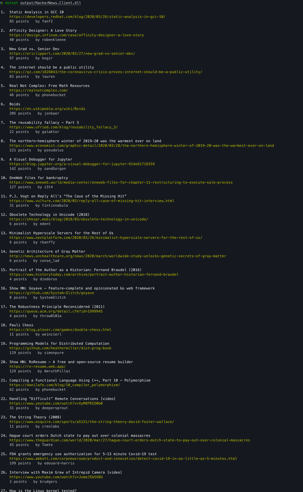

# Yet Another Hacker News CLI client

As I do enjoy reading [Hacker News](https://news.ycombinator.com/news) and got bored and wanted check how to make console apps for OSX, this somehow came to be.

It is a simple app, nothing complex here, it just displays top stories (top 30).

## Build

The project is build using `.net core 3.1` and it expects framework to exists. 

For building of the project you can use the included script: `./build_script.sh`.

## Running

To run the project:

Navigate to the directory where the output is.

```bash
dotnet {directory}/HackerNews.Client.dll
```

